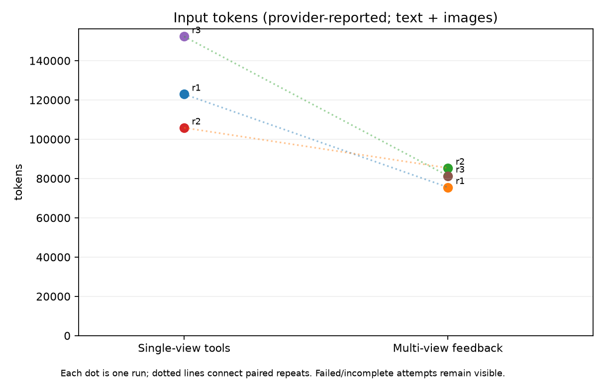
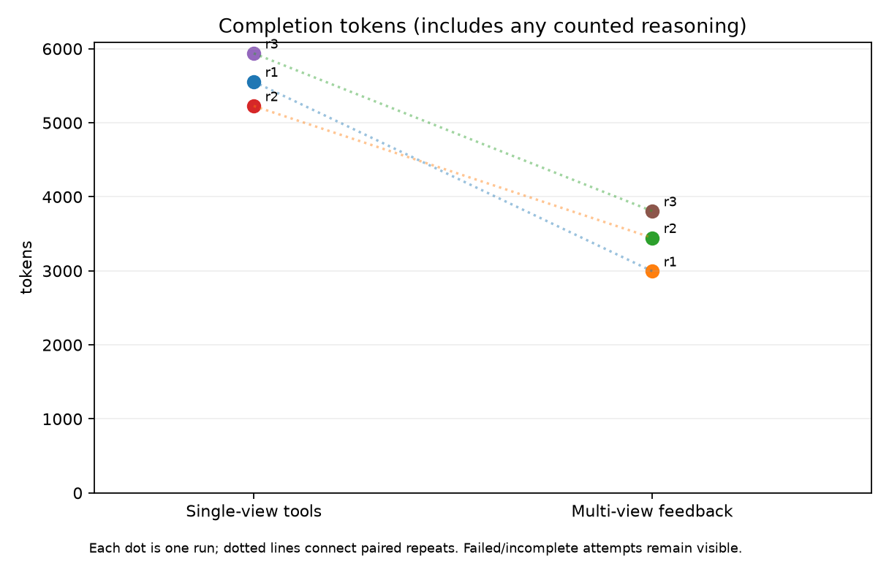
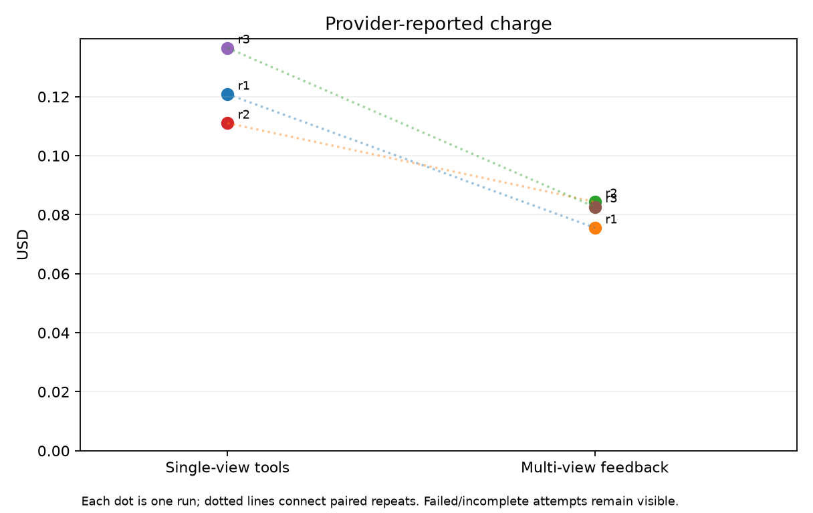
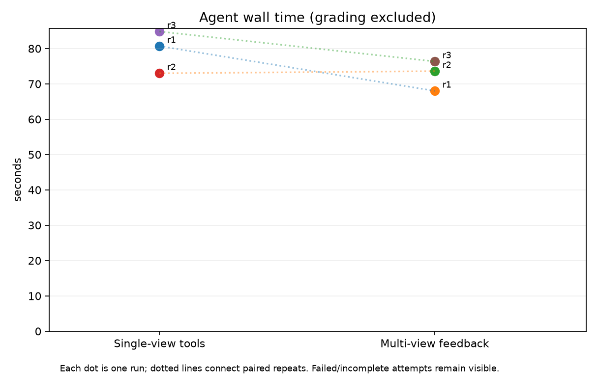
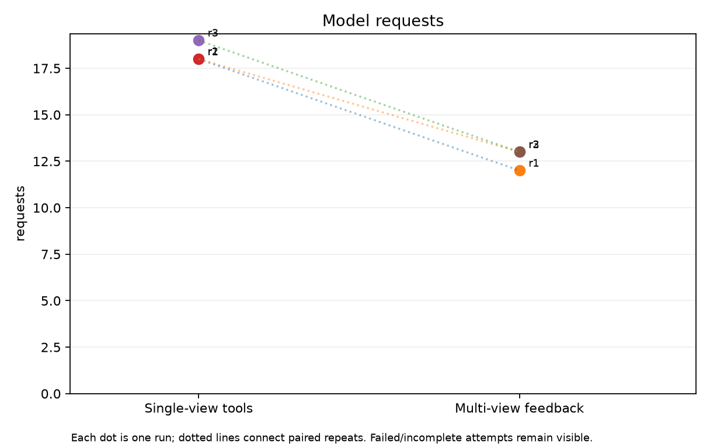
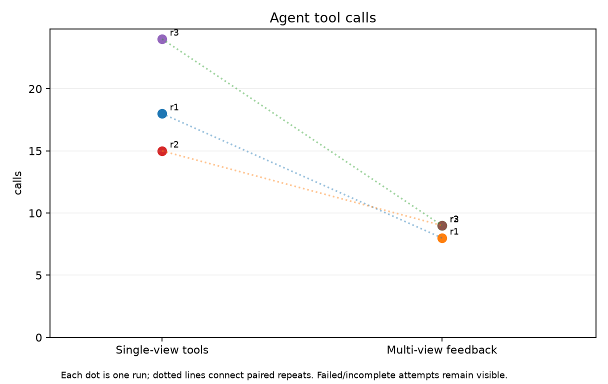

# Live Blender MCP vision-agent benchmark

These are actual provider usage and wall-clock measurements from the included runner. All attempts are listed. Unknown cost totals are omitted from the charge plot, not plotted as zero. Input tokens include text and images; reasoning tokens are not added again to completion totals. This small task does not establish performance on complex scenes.

| Repeat | Arm | Completed | Geometry checks passed | Input | Output | USD | Wall seconds | Model calls | Tool calls |
|---:|---|---|---|---:|---:|---:|---:|---:|---:|
| 1 | baseline | completed | True | 122972 | 5556 | 0.12088 | 80.70 | 18 | 18 |
| 1 | multiview | completed | True | 75525 | 2995 | 0.07556 | 68.02 | 12 | 8 |
| 2 | multiview | completed | True | 85368 | 3446 | 0.08439 | 73.61 | 13 | 9 |
| 2 | baseline | completed | True | 105845 | 5227 | 0.11105 | 73.00 | 18 | 15 |
| 3 | baseline | completed | True | 152335 | 5938 | 0.13657 | 84.83 | 19 | 24 |
| 3 | multiview | completed | True | 81369 | 3807 | 0.08267 | 76.36 | 13 | 9 |

3 complete, geometry-passing paired repeats are available. The automated grader checks final object dimensions/positions and brace removal, not artistic quality. Final inspection images are saved separately for visual review.

## Matched-pair descriptive differences

Input tokens (provider-reported; text + images): median paired reduction 38.6%, range 19.3% to 46.6%. Negative means multiview used more.
Completion tokens (includes any counted reasoning): median paired reduction 35.9%, range 34.1% to 46.1%. Negative means multiview used more.
Provider-reported charge: median paired reduction 37.5%, range 24.0% to 39.5%. Negative means multiview used more.
Agent wall time (grading excluded): median paired reduction 10.0%, range -0.8% to 15.7%. Negative means multiview used more.
Model requests: median paired reduction 31.6%, range 27.8% to 33.3%. Negative means multiview used more.
Agent tool calls: median paired reduction 55.6%, range 40.0% to 62.5%. Negative means multiview used more.

## Graphs

